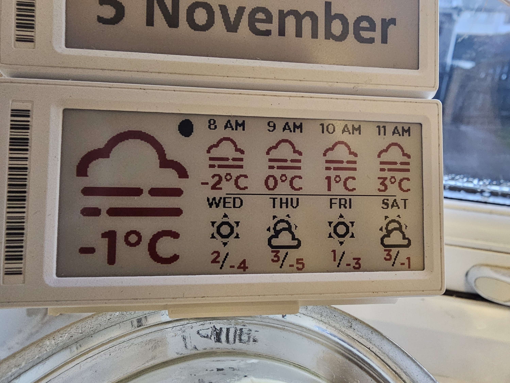
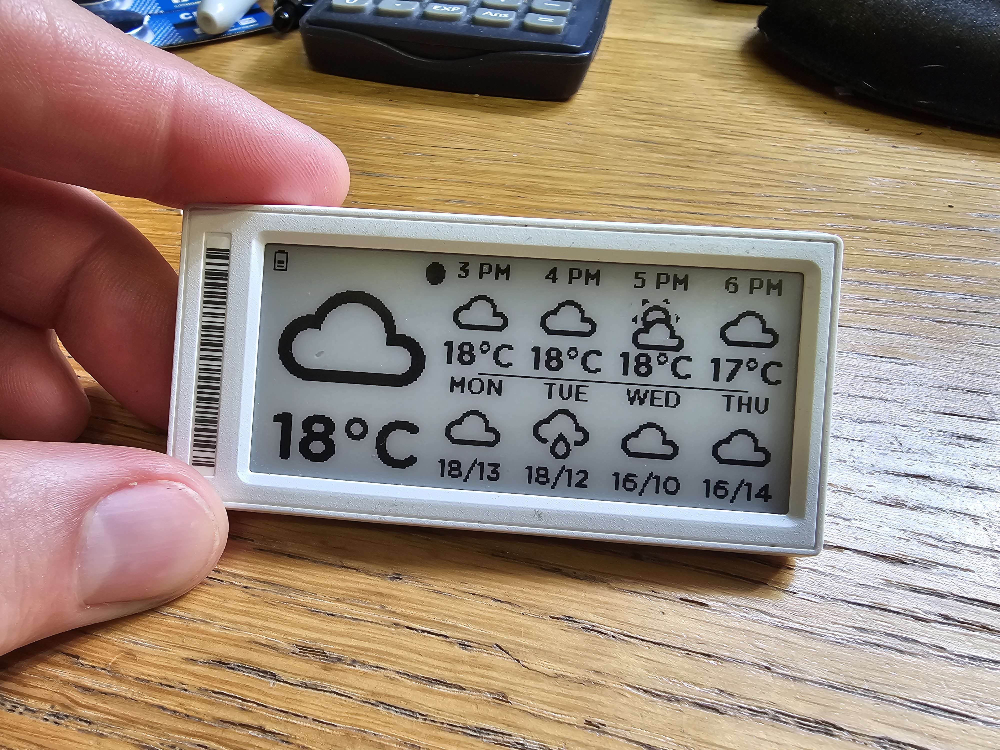
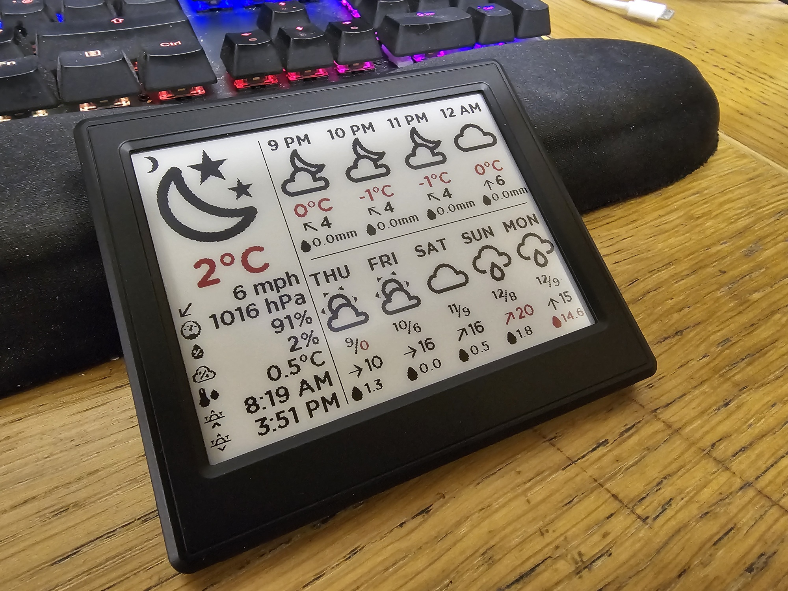
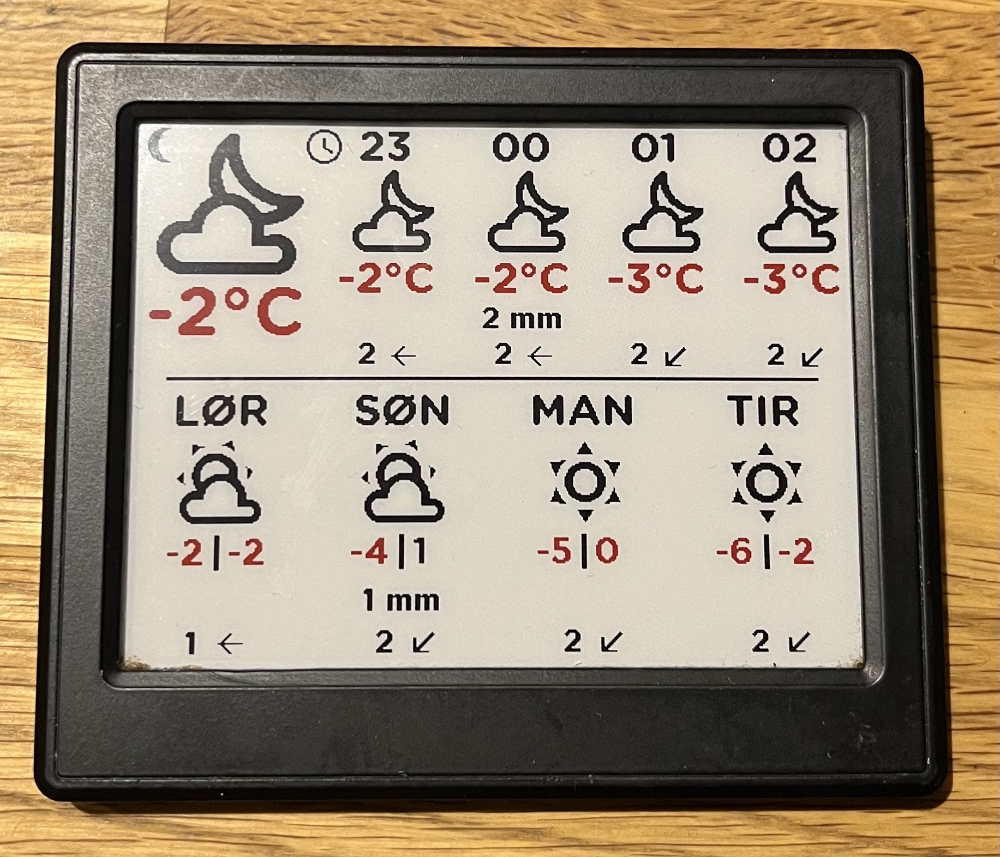
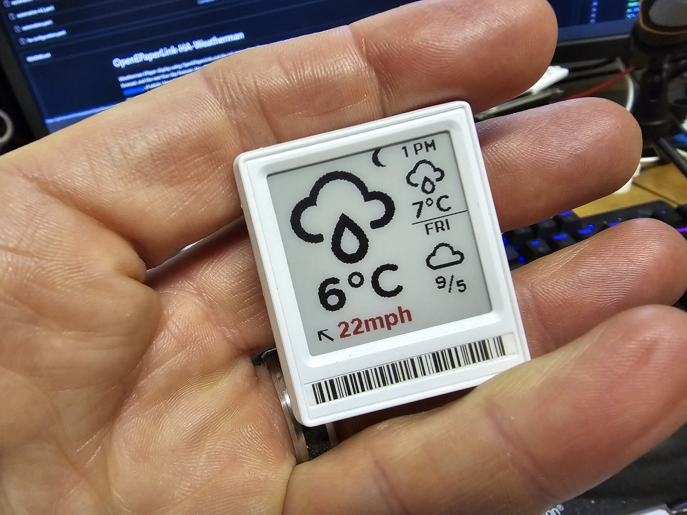

# OpenEPaperLink-HA-Weatherman
Weatherman EPaper display using OpenEPaperLink and the HA Integration. Shows current weather state and temperature, the next four hour forecast, and the next four day forecast. Also shows Moon phase. Based heavily from https://github.com/Madelena/esphome-weatherman-dashboard, of which I have been a contributer, and made my own ESPHome based version (code somewhere?!!).




Home Assistant and a working [OpenEpaper](https://openepaperlink.de/) setup, with HA Integration - https://github.com/jonasniesner/open_epaper_link_homeassistant

## Sensors/Integrations needed:

* https://github.com/jonasniesner/open_epaper_link_homeassistant (Install via HACS)
* https://www.home-assistant.io/integrations/met - Weather info
* https://www.home-assistant.io/integrations/moon - Moon phases
* https://www.home-assistant.io/integrations/sun - Sun sensor, help with weather icons if it's clear at night (so you don't see a Sun at night!)

The scripts will find your Weather Integration sensor, and will work no matter what it is called, as long as you have only one weather integration active, and as long as that exposes only one entity in Home Assistant. If you have more than one of either, set the value of the forecast_entity near the top of the `ha-configuration.yaml` file manually to be the name of your weather sensor e.g. `weather.forecast_home` or `weather.home` using the yaml like the below (remember to keep all indents as they are already in the file):
```
variables:
        forecast_entity: weather.home
```
The script also assumes your Moon sensor is called `sensor.moon_phase`. There is a service call to `weather.get_forecasts` at the top of the HA configuration file to get the hourly weather, which calls this data variable `weather_home_hourly`. `get_forecasts` is a different response to `get_forecast`, so make sure you are on HA version 2023.12 or greater - it will break if you use `get_forecast`!

## Breaking changes with HASS 2024.4!
There are breaking changes with HASS 2024.4, and you will need to change your configuration.yaml or else this will stop working!
There are quite a few changes needed, so it might be easiest to replace all the configuration with the [new one](ha-configuration.yaml).

## Tag size - 1.54", 2.9" and 4.2"
A 2.9" weather tag, which shows the current weather, and the following four hours and days ahead.


A fully featured "kitchen sink" 4.2" tag that has lots of current weather data, the Sun rising & setting times, an additional day on the daily forecasts, and a lot more info in all the forecasts.



Another more simple looking 4.2" tag, made by [@svenove](https://github.com/svenove/):



A small 1.54" mini version, which shows the current weather, and the following hour and day ahead.




## Installation
* Add font `GothamRnd-Bold.ttf` to `/config/media` Home Assistant (create the folder "media" too).
* Add template sensor `ha-configuration.yaml` to your configuration file in Home Assistant.
* Add contents of `automation-2.9.yaml` (2.9") or `automation-4.2.yaml` (4.2") to a new automation in Home Assistant (Choose "Edit in Yaml" from top right three dots in a new automation). The automation is using a time template of every 15 minutes - adjust according to taste! There is also a condition on the automation to stop updating between 11pm and 6am - to aid in the lifespan of the display. Other checks could be put in place to only allow for updating the display on human presense etc.

## Customizing
### Time format
Time format for the hourly conditions can be formatted using the python function `timestamp_custom()` for, e.g. 12h time - 2 PM, or e.g. 24h time - 14:

`{{ as_timestamp(weather_home_hourly['weather.home']['forecast'][0].datetime) | timestamp_custom('%I %p') }}` = 02 PM  
`{{ as_timestamp(weather_home_hourly['weather.home']['forecast'][0].datetime) | timestamp_custom('%I') | int }} {{ as_timestamp(weather_home_hourly.['weather.home']['forecast'][0].datetime) | timestamp_custom('%p') }}` = 2 PM  
`{{ as_timestamp(weather_home_hourly['weather.home']['forecast'][0].datetime) | timestamp_custom('%H') }}` = 14  

### Day names
To change the display of the day names to your prefered language, replace these occurences in the configuration with your own:
`{{ "%s" % (["Sun","Mon","Tue","Wed","Thu","Fri","Sat"][as_timestamp(weather_home_daily['weather.forecast_home']['forecast'][1].datetime) | timestamp_custom('%w') | int]) }}`

### Start daily forcast with today
By default, the first day shown is tomorrow.
If you want to display today as the first day, simply substract 1 from all the indexes in the configuration.
Example (changed [1] to [0]):
```
wm_temp_4: >
            {{ weather_home_daily['weather.forecast_home']['forecast'][0].temperature | round }}
```

### Precipitation accuracy
I have removed the rounding for precipitation values (usually in mm). This will add a lot more 0.0, 0.1, 1.2 numbers on your screen. To tidy it up and just have round numbers, just add `| round` filter to any precipitation value in ha-configuration, e.g:
```
wm_precipitation_0: >
          {{ weather_home_hourly['weather.home']['forecast'][0].precipitation | round }}
```

### Temperature right now
If you have an outdoor temperature sensor available in HASS, you could display that for the current temperature instead of the forecasted temperature.
Replace this with your temperature entity: `state_attr('sensor.weatherman_data_tag','wm_temp_0')`

### Units
The units for temperature, wind speed and precipitation are set in the forecast entity (cog wheel).
You might need to change the units in the automation to (e.g from C to F, mm to in, etc).

### Battery
There is a battery percentage for a tag in the attributes of the "weatherman" sensor (battery_strength_0000028329e608ff) for one of my tags, but this is no longer used - as the tags have a built in low battery sensor icon. You can remove this code in the weatherman template sensor if you wish. Or if you want a more dynamic battery icon - disable the low battery icon in the tag using your OEPL Access Point tag config command, and add in the following code to the automation:

```
- type: icon
          value: "{{ state_attr('sensor.weatherman_data_tag','battery_strength_0000028329e608ff') | string }}"
          x: 0
          y: 0
          size: 16
          color: >
            
              red
            
              black
            
```

